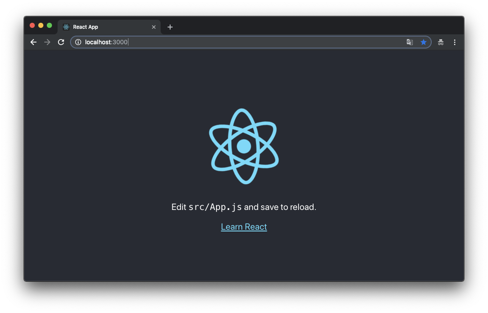
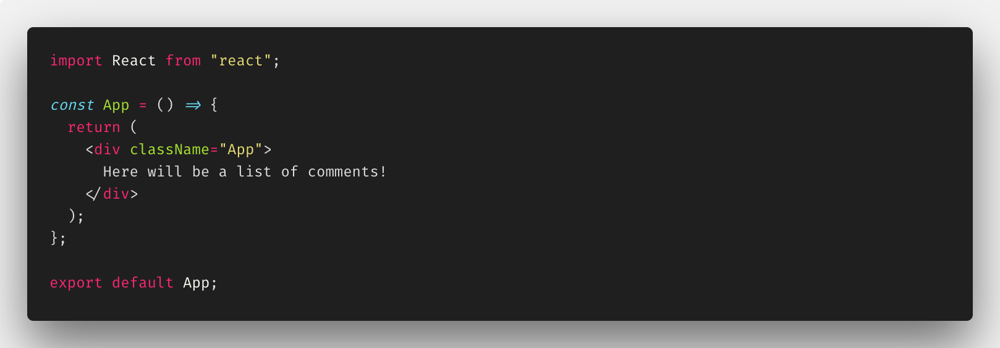
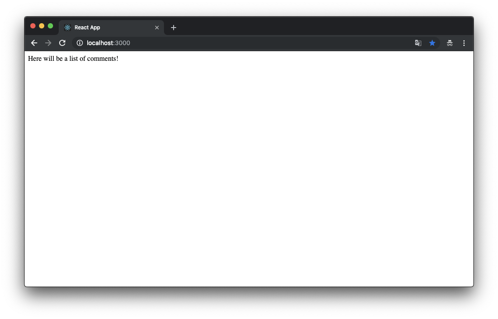
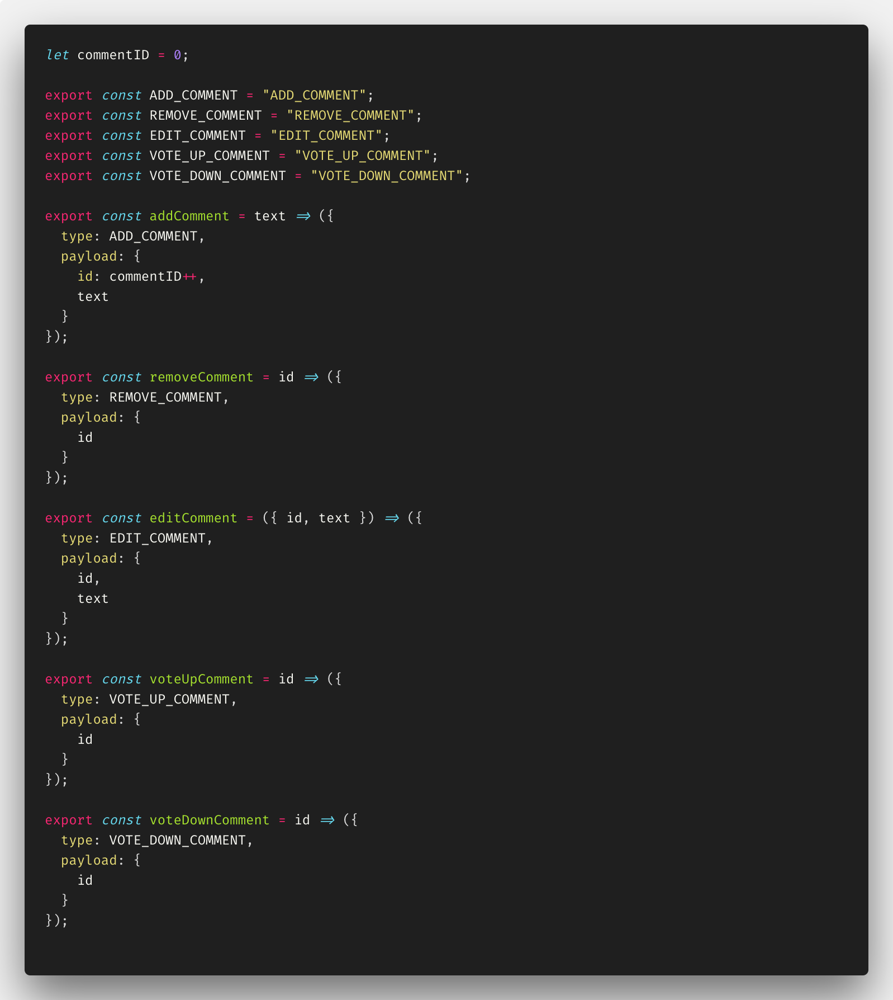
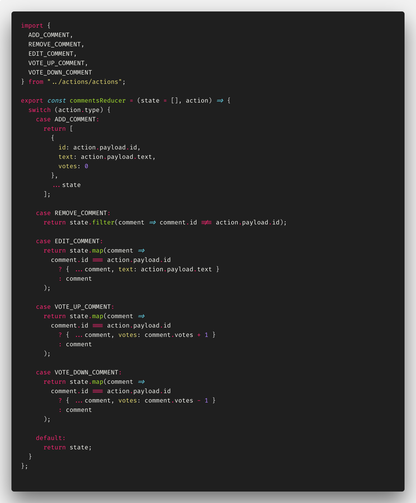

# \#4 skylabs - Redux Workshops

- [Three Principles](#three-principles)
- [Project setup](#project-setup)
- [Actions](#actions)
  - [Exercise 1](#exercise-1)
- [Reducers](#reducers)
  - [Exercise 2](#exercise-2)
- [Combine reducers](#combine-reducers)
  - [Exercise 3](#exercise-3)
- [Store](#store)
  - [Exercise 4](#exercise-4)
- [Connecting React with Redux](#connecting-react-with-redux)
  - [App Component](#app-component)
  - [Comment Component](#comment-component)
  - [CommentsList component](#commentslist-component)
  - [Exercise 5](#exercise-5)

## Three Principles

**Redux** can be described in three fundamental principles:

- **Single source of truth.**
  The state of your whole application is stored in an object tree within a single store.
- **State is read-only.**
  The only way to change the state is to emit an action, an object describing what happened.
- **Changes are made with pure functions**
  To specify how the state tree is transformed by actions, you write pure reducers.

You must always keep in mind these the three principles of Redux.

[Click here for more info](https://redux.js.org/introduction/three-principles)

## Project setup

The playground will be an app for managing comments. There will be a possibility to add, delete, edit and vote for comments.

To create our skylab app, you may choose one of the following methods:

**_npx_**

```bash
npx create-react-app skylab-app
```

**_npm_**

```bash
npm init react-app skylab-app
```

**_Yarn_**

```bash
yarn create react-app skylab-app
```

Now that our project is setup. In your terminal do the following:

```bash
cd skylabs-app
npm start
```

This should start our project on port **3000**



So now we have our boilerplate app. Next, we need to clear the app structure, for that, you need to do the following

```bash
rm src/App.* src/serviceWorker.js src/logo.svg
echo '' > src/index.js
echo '' > src/index.css
```

Before we start coding our app we need to install Redux. To do this type in terminal the following:

For **npm**

```bash
npm install redux react-redux
```

or if you use **Yarn**

```bash
yarn add redux react-redux
```

Right now we can start hacking 😉 our Redux app.

**App Component - App.js**

In folder `src` create a file `App.js` which will be containing the following code:



**Index.js**

Now let's create `index.js` file. It should be in folder `src`, too.


Now app looks like that:



## Actions

An **action** in Redux is a JavaScript object. It has a **type** and an optional **payload**. The type is often referred to as action type. While the type is a string literal, the payload can be anything from a string to an object.

In our case is an app for managing comments so we need actions, eg. add a comment. This action can look like this:

```javascript
{
    type: "ADD_COMMENT",
    payload: {
        text: "My first comment!"
    }
}
```

Since strings are prone to typos and duplicates it’s better to have action types declared as _constants_. This above action can look this:

```javascript
const ADD_COMMENT = 'ADD_COMMENT';

{
    type: ADD_COMMENT,
    payload: {
        text: "My first comment!"
    }
}
```

It is a best practice to wrap every action within a function. Such function is an **action creator**.

For above action the action creator can look this:

```javascript
const addComment = text => ({
  type: ADD_COMMENT,
  payload: {
    text
  }
});
```

For managing comments we need several types of actions: remove, edit a comment and for voting: thumb up and thumb down.

To remove comment we need know which comment should be removed. This can be done by passing comment's id to an action. The action object `REMOVE_COMMENT` will look like this:

```javascript
{
    type: "REMOVE_COMMENT",
    payload: {
        id: 4 // id of an example comment
    }
}
```

Next edit comment. For successfully edit comment we need exactly know which comment and what is new content of the comment. So an action object should look like this:

```javascript
{
    type: "EDIT_COMMENT",
    payload: {
        id: 4,
        text: "edited comment text!"
    }
}
```

With this knowledge, we can now make actions and action creators for the whole of our app. Let's do this!

Firstly in `src` create folder `actions` and in it create file `actions.js`.
Then create constants for each action name (add, edit, remove, thumb up, thumb down).
Here are the first three:

```javascript
const ADD_COMMENT = "ADD_COMMENT";
const REMOVE_COMMENT = "REMOVE_COMMENT";
const EDIT_COMMENT = "EDIT_COMMENT";
```

Next step is making actions creator. As you know, action creator is a function that returns action object. Let's write it.

```javascript
let commentID = 0;

const addComment = text => ({
  type: ADD_COMMENT,
  payload: {
    id: commentID++,
    text
  }
});
```

\*Note: _the variable `commentID` will store for us the next comment's id value_.

### Exercise 1

Based on the above write missing action types (vote up and vote down) and missing action creators.
Don't forget to export each action and each action creator.

**Don't look below.**

&nbsp;

&nbsp;

&nbsp;

**Try your self!**

&nbsp;

&nbsp;

&nbsp;

**Good job!** Right now your file should look similar to this.



## Reducers

A **reducer** is a **pure function**.
It always produces the same output when the input stays the same. It has no _side-effects_, thus it is only an input/output operation.
A reducer has two inputs: _current application's state and action_.
The state is always the global state object from the Redux store.
The action is the dispatched action with a type and optional payload.
The reducer reduces - that explains the naming - the previous state and incoming action to a new state.

Before we start writing our reducers function we need to think about how the state's structure of our app should look.
Keep in mind that this structure should be as flat as possible.
Our app is a simple case, comments are anonymous so we have only a comment's list - the state structure is an array with comments.

```javascript
{
  comments: [
    {
      id: 1,
      text: "This is the first comment!",
      votes: 10
    },
    {
      id: 2,
      text: "Another comment.",
      votes: -1
    }
  ],
}
```

But...
If comments will be related to a user, the state structure can look like this:

```javascript
{
  comments: [
    {
      id: 1,
      userId: "123aba345",
      text: "This is the first comment!",
      votes: 10
    },
    {
      id: 2,
      userId: "987cad654",
      text: "Another comment.",
      votes: -1
    }
  ],
  users: [
    {
      id: "123aba345",
      firstName: 'John',
      lastName: 'Smith',
    },
    ...
  ]
}
```

Time to write the first reducer.

In `src` create folder `reducers`. In this folder create file `reducers.js`.

As you know, reducer on the input gets a current state.
But...
What if our app just start and there is no current state yet?
For this case, we prepare `initialState` variable.

```javascript
const initialState = {
  comments: [],
  user: []
};
```

Thanks to ES6 syntax - default argument - in the reducer function we can handle the initial application state in a simple way.

```javascript
const reducer = (state = initialState, action) => {
  return state;
};
```

So we have done handling the initial application state. It's time to handle actions.

The reducer calculates the new state depending on the action type.
Moreover, it should return at least the current state when no action type matches.
When the action type matches a valid clause the reducer calculates the new state and returns a new object.

In JavaScript, a **switch case** can help to evaluate different action types.
Otherwise, it returns the previous state as default.

Let's start with the add comment action.

```javascript
const reducer = (state = initialState, action) => {
  switch (action.type) {
    case ADD_COMMENT:
      return {
        ...state,
        comments: [
          {
            id: action.payload.id,
            text: action.payload.text,
            votes: 0
          },
          ...state.comments
        ]
      };
    default:
      return state;
  }
};
```

But...
The reducer doesn't know what is `ADD_COMMENT`, because all our actions types are defined in file `actions.js`. There are exported, too. Time to import this action on the top of the reducer file.

```javascript
import { ADD_COMMENT } from "../actions/actions";
```

So the first change of app state is handled.

The case that needs more effort on the first sight is the remove comment action.
The new state should contain a comments list (array) without the one removed comment.
But...

With `Array.filter()` method - it will be easy. All that we need to do is filter the current comments list and return all comments with _id_ different than removed one.

```javascript
const reducer = (state = initialState, action) => {
  switch (action.type) {
    case ADD_COMMENT:
      ...
    case REMOVE_COMMENT:
      return {
        ...state,
        comments: state.comments.filter(comment => comment.id !== action.payload.id)
      }
    default:
      return state;
  }
};
```

### Exercise 2

The goal is to write code for handling all other actions (edit, vote). Note that voting is two different actions (`VOTE_UP_COMMENT` and `VOTE_DOWN_COMMENT`). Remember to import all of the actions.

**Don't look below.**

&nbsp;

&nbsp;

&nbsp;

**Try your self!**

&nbsp;

&nbsp;

&nbsp;

**Good job!** Right now your file should looks similar to this.


## Combine reducers

Our app state is combined from two small states: `comments` and `users`.
When you look closer to the reducers function, you can see that for each comment action we are taking the whole state of the app.
This no looks pretty and need from us more work.
So because the comments state is not related with the user state the best practice is to extract them to separated files.

Let's do this for the comment's reducer.

```javascript
const commentsReducer = (state = [], action) => {
  switch (action.type) {
    case ADD_COMMENT:
      return [
        {
          id: action.payload.id,
          text: action.payload.text,
          votes: 0
        },
        ...state
      ];
  }
};
```

As you can see, now the initial state is an empty array.
We don't need to care about the whole state of the app.
Our new reducer will handle only the part of the app state that is related to comments.
Handling small parts of data is always easier and makes code cleaner.
Our new reducer returns a new array of comments - there is no mutation and it is a pure function - so we don't break any of the three Redux principles.

Ok, we have our new separated reducers.
Time to merging them into one the root reducer.
The Redux has a helper function called `combineReducers` that help us to merge reducer into one reducer.
It can look like this below:

```javascript
import { combineReducers } from "redux";

import commentsReducer from "./commentsReducer";
import usersReducer from "./usersReducer";

const rootReducer = combineReducers({
  comments: commentsReducer,
  users: usersReducer
});
```

### Exercise 3

Your goal is to refactor file `reducers.js` that will import the extracted **comments** reducer (it should be in a separated file called `commentsReducer.js`).
Don't waste your time for the users' reducer file - we don't create any action for users state - so you can just return the unchanged user state in it.

**Don't look below.**

&nbsp;

&nbsp;

&nbsp;

**Try your self!**

&nbsp;

&nbsp;

&nbsp;

**Good job!** Right now your files should looks similar to these:

`commentsReducer.js`


`usersReducer.js`


`rootReducer.js`


## Store

What is Redux Store?
The store is an object that holds the whole state of our application.
It's a place that 'glues' actions and reducers.
There should be only one store in Redux application.
The only way to change the state inside it is to dispatch an action on it.

Let's create our store.
For this, use a function `createStore()`.
This function takes as the first argument the higher orderer reducer (this one which is not composed with others).
In our app it's `rootReducer`.
Note that function createStore as the second argument (optional) takes preloaded state of store.
It can be usefully in eg. to hydrate the state from server.
In the folder `src/store` create file `store.js`

```javascript
import { createStore } from "redux";

import { rootReducer } from "../reducers/rootReducer";

const store = createStore(rootReducer);

export default store;
```

Yeah! That it's! Our store is created!

Redux itself is a small library about 2KB.
The Redux store exposes a simple API for managing the state.
The most important methods are:

- `getState` for accessing the current state of the application
- `dispatch` for dispatching an action
- `subscribe` for listening on state changes

Time to play with them. We will play in the browser's console.

So we need to export as global variables the store and the actions we have created earlier.
Open file `src/index.js` and delete all from it. Update it with the following code:

```javascript
import { store } from "./store/store";
import { addComment, voteUpComment } from "./actions/actions";

window.store = store;
window.addComment = addComment;
window.voteUpComment = voteUpComment;
```

Now run dev server with:

```bash
npm start
```

head over http://localhost:3000 and open up the console with F12.

We've exported the store as a global variable so we can access its methods. Let's try!

The first - accessing current state.

```javascript
store.getState();
```

output:

```bash
{comments: Array(0), users: Array(0)}
```

Zero comments, zero users. Indeed! We haven't update the initial state yet.

The interesting thing is that we can listen to state updates with **subscribe**.

The subscribe method accepts a callback that will call whenever an action is dispatched.
Dispatching an action means notifying the store that we want to change the state.

Let's register a callback!

```javascript
store.subscribe(() => console.log("Yeah! It's Redux!"));
```

The only way to change state in Redux is dispatching an action.
To do this you need to call the **dispatch** method.
We have only one action on our disposal: `addComment()` for adding a new comment to the state.

Let’s dispatch the action with:

```javascript
store.dispatch(addComment("New Comment!"));
```

After you hit Enter key you should see:

```bash
Yeah! It's Redux!
{type: "ADD_COMMENT", payload: {…}}
```

To verify that the state changed run again:

```javascript
store.getState();
```

Now the output should be:

```bash
{comments: Array(1), users: Array(0)}
```

And that's all!

Simply - the Redux!

### Exercise 4

Explore these three methods as an exercise.
Add more actions and play with them in the browser's console.

## Connecting React with Redux

Redux is framework agnostic.
It can be used with vanilla JS. Or with Angular. Or with React.
There are many bindings that can join Redux together with your favorite framework.
For React is **react-redux**.
You can install it by using:

```bash
npm install react-redux
```

The react-redux package exposes a very simple interface, and all you should be interested in is just the following:

- **\<Provider store>** - wraps the React application and makes the Redux state available to all container components in the application’s hierarchy
- **connect([mapStateToProps], [mapDispatchToProps], [mergeProps], [options])**  -  creates a higher-order component for making container components out of base React components

The fundamental things to know are:

- the mapStateToProps function
- the mapDispatchToProps function or object

**mapStateToProps** does exactly what its name suggests:
it connects a part of the Redux state to the props of a React component.

**mapDispatchToProps** does something similar,
but for actions. mapDispatchToProps connects Redux actions to React props.

To start connecting Redux with React we’re going to use Provider in `src/index.js`.
Provider is a high order component coming from react-redux - it wraps up React app and makes available to it the entire Redux’s store.


### App Component

Our app component should look like this:

```javascript
import React from "react";

const App = () => <div className="App">Here will a list of comments!</div>;

export default App;
```

You need to change the file name (exactly extension) for `App.jsx`.
For now it's enough, we return to this component later.

### Comment Component

This component will be responsible for displaying a single comment in the CommentsList component.
Create a folder `scr/components`. Then create a file `Comment.jsx`.


As you can see it's very simple. Zero logic. Only presentation.
That's what exactly should the component do.

### CommentsList component

In this component, we'll be displaying all of the comments using created earlier Comments component.

```javascript
import React from "react";

import { Comment } from "./Comment";

const CommentsListRaw = ({ comments }) => (
  <ul>
    {comments.map(comment => (
      <Comment key={comment.id} {...comment} />
    ))}
  </ul>
);
```

Time to connect our React component to the Redux store. We will use the react-redux method `connect`.
We need to import it. Add the following import:

```javascript
import { connect } from "react-redux";
```

Now we need to pass the part of app state related with comments list to the component.

```javascript
const mapStateToProps = state => ({
  comments: state.comments
});

export const CommentsList = connect(mapStateToProps)(CommentsListRaw);
```

The function **mapStateToProps** on input gets the app state and on output returns an object with the specified part of the app state.
In our case, the specified part of app state is `state.comments`.
It will be passed to the component CommentList as its props `comments` using the function `connect`.

Let's return to App component and update it.

```javascript
import React from "react";
import { CommentsList } from "./components/CommentsList";

const App = () => <CommentsList />;

export default App;
```

\*\*Time to make small test. In the file `index.js` import an action creator `addComment`. Then on the bottom of the file (below ReactDOM.render() method) put these two lines.

```javascript
store.dispatch(addComment("The first comment!"));
store.dispatch(addComment("The second comment!"));
```

Yeah! It's kind of a hardcode, but if you have done all things properly you should see something like this:


Now we try to connect an action to component. Let's do fo voting up.
Go back to `Comments.jsx`.
As in CommentsList component we need to import `connect` method from _react-redux_. We need to import an action creator for voting up. It will be `voteUpComment`.

```javascript
import React from "react";
import { connect } from "react-redux";

import { voteUpComment } from "../actions/actions";

const CommentRaw = ({ text, votes, id, voteUpComment }) => (
  <li>
    {text} <span>votes: {votes}</span>
    <button onClick={() => voteUpComment(id)}>Vote Up</button>
  </li>
);

export const Comment = connect(
  null,
  { voteUpComment }
)(CommentRaw);
```

As you can see we do some refactoring.
We change the name of the base component and add a button for voting up.
The last thing we need to do is dispatch the action to the store.
As earlier, we use `connect`, but this time we don't pass any state to props so the first argument is null.
The second one is an object with our action creators that we pass to the component.


### Exercise 5

Time to own work.

Add an opposite feature to the voting up.
If you want you can add a feature for delete a comment or even a feature for add a comment.

**NOTE!** So if everything is OK, remove this added code \*\*
